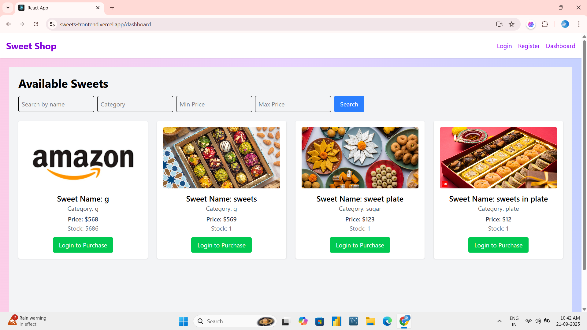
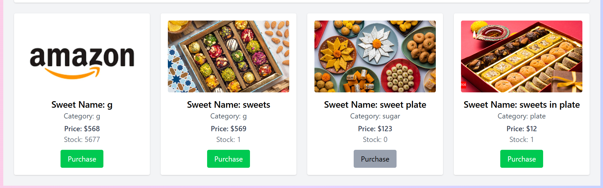
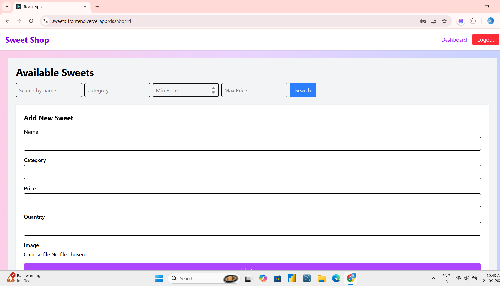

# 🍬 Sweet Shop

A full-stack web application for managing and purchasing sweets online. Built with **React** and **Tailwind CSS** for the frontend and a REST API backend for authentication and sweet inventory management.  

🔗 **Frontend Repo:** [Sweet Shop Frontend](https://github.com/Binduvarsha23/sweetsFrontend.git)  

---

## 🌟 Project Overview

Sweet Shop is designed to provide a smooth user experience for both customers and admins:

### 👤 User Features
- Register and log in with role-based access.
- Browse sweets with filters by name, category, or price range.
- Purchase sweets (automatically decreases stock).

### 🛠️ Admin Features
- Add new sweets with images.
- Edit and delete existing sweets.
- Manage stock levels (restock or decrease quantity).

### 💎 Additional Features
- **Responsive Design:** Works seamlessly on mobile and desktop.
- **Routing:** Managed with React Router for smooth navigation.
- **Role-Based Display:** Users see public sweet listings; admins see the admin panel for CRUD operations.

---

## 🖥️ Setup and Running Instructions

### ✅ Prerequisites
- **Node.js** (v14 or higher, LTS recommended)
- **npm** (comes with Node.js)
- **MongoDB** or a running backend API at `https://craftsperson.onrender.com/api`

---

### 🔹 Backend Setup

1. **Clone your backend repository**(assumed to exist):
   ```bash
   git clone https://github.com/Binduvarsha23/sweets.git
   
2. **Install dependencies:**
```bash
npm install


3. **Create a .env file with required variables:**
```bash
MONGO_URI=<your_mongodb_connection_string>
JWT_SECRET=<your_jwt_secret>
PORT=5000


4 **Run the backend server:**
```bash
npm run dev


##The backend runs on http://localhost:5000.

🔹 Frontend Setup

1 **Clone the frontend repository:**
```bash
git clone https://github.com/Binduvarsha23/sweetsFrontend.git
cd sweetsFrontend


2. Install dependencies:
```bash
npm install


3. Ensure the backend API URL is correct in src/api/api.js:

const API = axios.create({
  baseURL: "http://localhost:5000/api",
});


4. Start the frontend:

npm start


Open your browser at http://localhost:3000.

## 🔗 Backend API Endpoints

| Endpoint                 | Method | Role   | Description                          |
|---------------------------|--------|--------|--------------------------------------|
| `/auth/register`          | POST   | Public | Register a user or admin             |
| `/auth/login`             | POST   | Public | Log in and return token, role, username |
| `/sweets`                 | GET    | Public | Get all sweets                        |
| `/sweets/search`          | GET    | Public | Search sweets by name, category, or price |
| `/sweets`                 | POST   | Admin  | Add a new sweet                        |
| `/sweets/:id`             | PUT    | Admin  | Update an existing sweet              |
| `/sweets/:id`             | DELETE | Admin  | Delete a sweet                         |
| `/sweets/:id/purchase`    | POST   | User   | Purchase a sweet (decrease stock)     |
| `/sweets/:id/restock`     | POST   | Admin  | Restock a sweet (increase stock)      |


## 📸 Screenshots

- **Login Page:** Login form for users and admins.  
    

- **Dashboard:** Browse sweets with search filters and purchase functionality.  
    

- **Admin Panel:** Add, edit, delete, and restock sweets using the form.  
    


## 🤖 My AI Usage

### AI Tools Used
**ChatGPT (OpenAI):** Used for generating and refining React components, debugging, and brainstorming UI logic.

### How AI Was Used
- Structured `Dashboard.js` and `AdminPanel.js` components, especially implementing search filter logic and admin CRUD operations.
- Debugged purchase and restock logic.
- Suggested optimizations for state management and component reusability.

### Reflection
AI tools significantly sped up development by:
- Providing quick starting points for complex logic.
- Reducing boilerplate and repetitive coding.
- Helping avoid common bugs, though manual adjustments were required to match backend responses.

AI acted as a collaborative partner, not a replacement for critical thinking.

### 🏆 Conclusion
**Sweet Shop** is a user-friendly, role-based, and responsive application for managing sweets inventory. Users can explore and purchase sweets, while admins have full control over the inventory.
